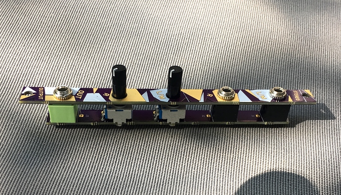

## Passive Stereo output in 2hp (a companion for [nearness](https://github.com/sarnesjo/nearness))

[more info here...](https://llllllll.co/t/2hp-passive-stereo-output-a-companion-for-nearness/14189)

Most of the stereo outs on the market are quite large and with a nearness you can quickly create a large stereo field. Having the extra pan knobs on most stereo outs tends to be irrelevant when using nearness (well, less relevant). The new ALM output looks good, but I wanted to put together a super-duper easy DIY kit. This thing is totally passive & so simple, there aren’t even any resistors! here is the BOM:

+ a PCB
+ a panel
+ 2 mono thonkiconn jacks
+ 2 9mm tall trimmer pots
+ 1 stereo thonkiconn jack

The only thing you need to know about assembly besides looking at the picture for parts placement is to solder the jacks first, then the pots.

 I suggest you do the jacks while screwed into the panel. Then take the panel off and insert and bend the pots. When soldering the pots, put the panel back on again to make sure everything is lined up properly!

 The stabilizing legs of the pots are bent around the outside of the PCB and soldered on the back side to rectangular pads. Make sure that the jacks remain vertical when doing this!

---
[CC BY-SA 4.0](https://creativecommons.org/licenses/by-sa/4.0/)
